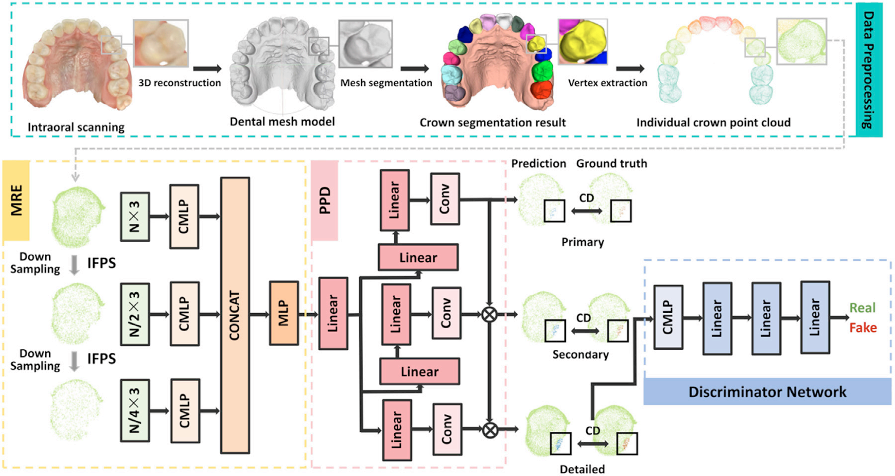

# PF-Net: Point Cloud Completion for Dental Crown

PF-Net completes partially scanned dental crowns from intraoral scans (IOS).

## Problem
Intraoral scanners often miss crown parts due to movement, saliva, or limited angles.

## Method
PF-Net takes a partial crown point cloud and predicts missing regions via multi-scale feature learning.

